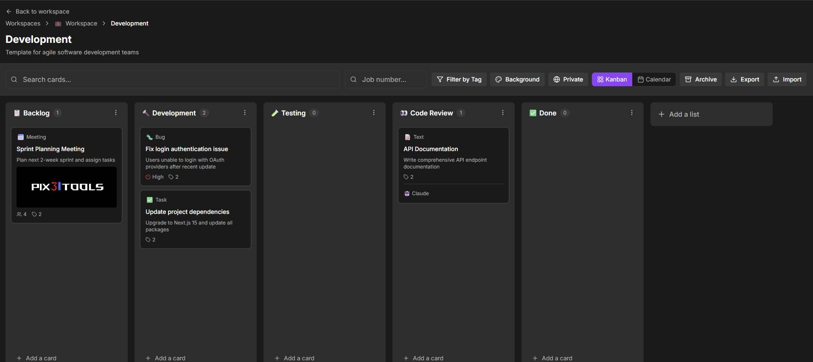
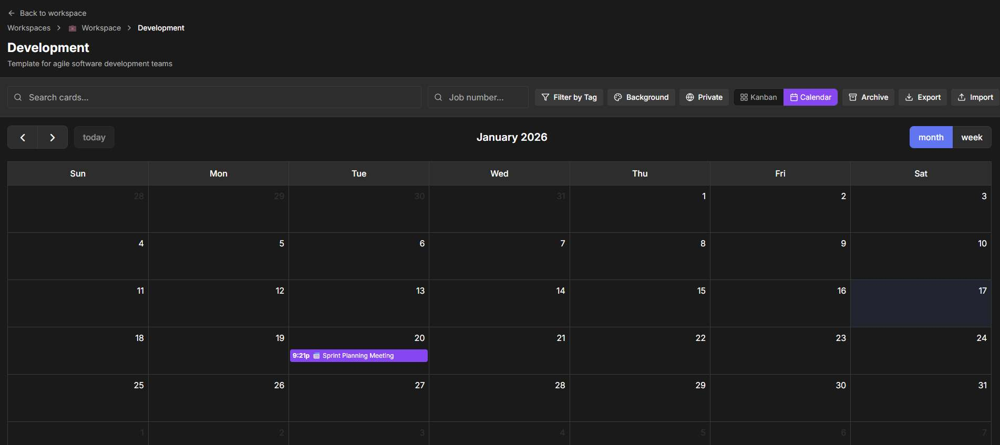
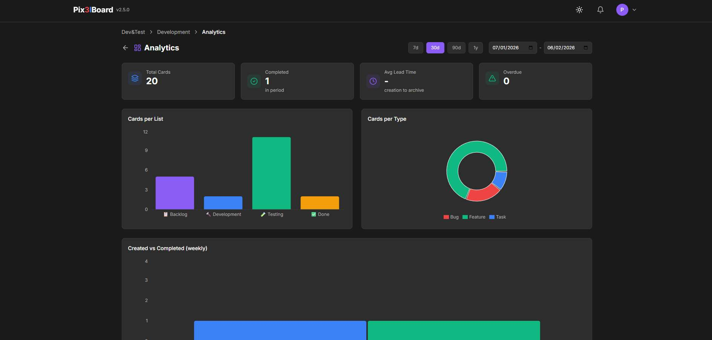
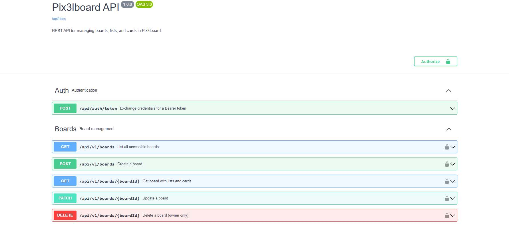

# Pix3lBoard

[](https://nextjs.org/)
[](https://www.typescriptlang.org/)
[](https://turso.tech/)
[](https://tailwindcss.com/)
[](LICENSE)
[](#)
[](/docs)
[](https://vercel.com/)

[](https://board.pix3ltools.com/public/3sZ6MGNB-KPP2qBJMELql)
[](https://www.youtube.com/watch?v=1yUgNO1Q6Nc)

**Prompt → Rating → Tool (Midjourney / Suno / Flux / etc.) → Job # → Secure Cloud Sharing**

Pix3lboard is a modern, lightweight Kanban board application built with Next.js 14, designed for project management with support for AI-specific workflows. Your data is stored securely in the cloud and syncs across all your devices.

> **Note**: This is an experimental demo. Data persistence is not guaranteed and may be reset at any time.

## Screenshots

### Kanban View


### Calendar View


### Analytics Dashboard


### REST API Documentation


## Features

### Core Functionality
- **Workspaces & Boards**: Organize projects with customizable workspaces and boards
- **Kanban Lists & Cards**: Full drag & drop support for lists and cards
- **Multiple Card Types**:
  - **AI Content**: Music, Video, Image, Audio, Text
  - **Project Management**: Task, Bug, Feature, Meeting
  - Type-specific fields (bug severity, feature priority/effort, meeting attendees)
- **AI-Specific Fields**:
  - AI prompts and tool tracking
  - Rating system (1-5 stars)
  - Tags and links management
- **Project Management Fields**:
  - Job Number tracking (format: Letter-2digits-4digits)
  - Responsible person assignment
  - Due dates and meeting dates
- **Card Comments**: Add comments to cards with author and timestamp
- **Activity Log**: Track all card changes with timestamps (who did what and when)
- **Checklists**: Add subtasks with progress tracking
- **Card Thumbnails**: Add images to cards with upload and lightbox preview
- **File Attachments**: Upload files to cards (PDF, documents, images, max 10MB)
- **Card Archiving**: Archive completed cards without deleting them
- **Calendar View**: View cards with due dates and meetings in a calendar
- **Public Boards**: Share boards publicly with a read-only link
- **Board Sharing**: Share boards with specific users (4 granular roles: Owner, Editor, Commenter, Viewer)
- **Full-Text Search**: Search cards by title, description, and comments (FTS5-powered)
- **In-App Notifications**: Bell icon with unread count, notifications for assignments, comments, and due dates
- **Filters**: Filter by tags, job number, responsible person, and quick filters (My cards, Due soon, Overdue, Unassigned, High priority)
- **Analytics Dashboard**: Board-level metrics with interactive charts (cards per list/type, throughput, lead time, overdue tracking) and configurable date ranges
- **Pix3lWiki Integration**: Link cards to wiki pages, wiki badge on linked cards, header navigation to companion wiki app
- **REST API v1**: Public API with Bearer token auth for external applications — full CRUD for boards, lists, cards with Swagger UI at `/docs`
- **Export/Import**: Backup and restore your data as JSON
- **Dark Mode**: Eye-friendly dark theme (light mode coming soon)

### Cloud Storage & Authentication
- **User Accounts**: Register and login with email/password
- **Admin Approval**: New accounts require admin approval before access
- **Cloud Sync**: Data automatically syncs across all devices
- **Secure Storage**: Data stored in Turso (SQLite) cloud database
- **JWT Authentication**: Secure token-based sessions

### Admin Panel
- **User Management**: View all users with statistics
- **User Approval**: Approve pending user registrations
- **Create Users**: Admin can create pre-approved accounts
- **Delete Users**: Remove users and all their data
- **Reset Passwords**: Admin can reset user passwords
- **Database Backup & Restore**: Download complete database backup as JSON, or restore from a previously exported backup (atomic all-or-nothing operation)
- **Archived Cards Export**: Export all archived cards with comments as JSON
- **Storage Cleanup**: Analyze and delete orphaned blob files to free storage space

### User Experience
- **Responsive Design**: Works on desktop, tablet, and mobile
- **User Menu**: Avatar with dropdown for account info and logout
- **Keyboard Shortcuts**: ESC to close modals, click outside to dismiss
- **Touch Support**: Drag & drop works on touch devices
- **Auto-save**: Changes saved automatically (throttled to reduce API calls)
- **Toast Notifications**: Clear feedback for all actions

### Performance & Scalability (v2.4.2)
- **Indexed State**: O(1) entity lookups using Map-based data structures
- **Delta Sync**: Only changed entities are sent to the server (not full data)
- **Granular API Endpoints**: Separate endpoints for workspaces, boards, lists, cards
- **Paginated Cards**: Load cards in pages (50 per request by default)
- **Change Tracking**: Automatic tracking of mutations for efficient sync
- **Conflict Resolution**: Detects concurrent edits and prompts user to overwrite or discard
- **Optimized for 500-1000 concurrent users**

## Tech Stack

- **Framework**: Next.js 14 (App Router)
- **Language**: TypeScript (strict mode)
- **Database**: Turso (libSQL/SQLite)
- **File Storage**: Vercel Blob
- **Authentication**: Custom JWT with bcryptjs
- **Validation**: Zod schema validation
- **Styling**: Tailwind CSS with custom CSS variables
- **Drag & Drop**: @dnd-kit
- **Icons**: Lucide React
- **Charts**: Recharts
- **Date Handling**: date-fns
- **ID Generation**: nanoid

## Getting Started

### Prerequisites
- Node.js 18+
- npm or yarn
- Turso account (free tier available)

### Installation

1. Clone the repository:
```bash
git clone https://github.com/Pix3ltools-lab/pix3lboard.git
cd pix3lboard
```

2. Install dependencies:
```bash
npm install
```

3. Create a Turso database:
```bash
# Install Turso CLI
curl -sSfL https://get.tur.so/install.sh | bash

# Login to Turso
turso auth login

# Create a database
turso db create pix3lboard

# Get the database URL
turso db show pix3lboard --url

# Create an auth token
turso db tokens create pix3lboard
```

4. Set up environment variables:
```bash
cp .env.example .env.local
```

Edit `.env.local` with your credentials:
```env
# Turso Database
TURSO_DATABASE_URL="libsql://your-database.turso.io"
TURSO_AUTH_TOKEN="your-auth-token"

# JWT Secret (generate a random string)
JWT_SECRET="your-random-secret-key-min-32-chars"

# Vercel Blob (for image uploads)
BLOB_READ_WRITE_TOKEN="your-vercel-blob-token"
```

5. Initialize the database:
```bash
npm run db:setup
```

6. Run the development server:
```bash
npm run dev
```

7. Open [http://localhost:3000](http://localhost:3000) in your browser

### Build for Production

```bash
npm run build
npm run start
```

### Deploy to Vercel

1. Push your code to GitHub
2. Import the project in Vercel
3. Add a Blob store in Vercel dashboard (Storage > Create > Blob)
4. Add environment variables:
   - `TURSO_DATABASE_URL`
   - `TURSO_AUTH_TOKEN`
   - `JWT_SECRET`
   - `BLOB_READ_WRITE_TOKEN` (auto-added when creating Blob store)
5. Deploy

## Project Structure

```
pix3lboard/
├── app/                          # Next.js App Router pages
│   ├── api/                      # API routes
│   │   ├── auth/                 # Authentication endpoints
│   │   ├── admin/                # Admin endpoints (users, cleanup)
│   │   ├── workspaces/           # Workspace endpoints
│   │   ├── boards/               # Board endpoints
│   │   ├── lists/                # List endpoints
│   │   ├── cards/                # Card endpoints
│   │   ├── sync/                 # Delta sync endpoint
│   │   ├── data/                 # Legacy data endpoint
│   │   ├── v1/                   # REST API v1 (boards, lists, cards)
│   │   └── docs/                 # OpenAPI spec endpoint
│   ├── admin/                    # Admin panel page
│   ├── docs/                     # Swagger UI page
│   ├── login/                    # Login/Register page
│   ├── workspace/[id]/           # Workspace detail
│   │   └── board/[boardId]/      # Board view + analytics
│   ├── page.tsx                  # Home page (workspaces)
│   ├── layout.tsx                # Root layout
│   └── globals.css               # Global styles
├── components/
│   ├── analytics/                # Dashboard charts and metrics
│   ├── board/                    # Board-related components
│   ├── card/                     # Card field components
│   ├── kanban/                   # Kanban board components
│   ├── layout/                   # Header, UserMenu, etc.
│   ├── providers/                # Context providers
│   ├── ui/                       # Reusable UI components
│   └── workspace/                # Workspace components
├── lib/
│   ├── auth/                     # Authentication functions
│   ├── db/                       # Database client and setup
│   ├── context/                  # React contexts
│   ├── storage/                  # Export/import utilities
│   └── utils/                    # Helper functions
├── types/                        # TypeScript types
│   ├── index.ts                  # Core domain types
│   ├── api.ts                    # API response types
│   └── sync.ts                   # Delta sync types
└── public/                       # Static assets
```

## Usage Guide

### Creating an Account

1. Go to the login page
2. Click "Don't have an account? Register"
3. Enter your email and password (min 8 characters, must include uppercase, lowercase, and number)
4. Click "Create Account"
5. Wait for admin approval (you'll see "Account pending approval" until approved)

### Creating Your First Workspace

1. Click "Create Workspace" on the home page
2. Give it a name, choose an icon and color
3. Click "Create Workspace"

### Creating a Board

1. Open a workspace
2. Click "Create Board"
3. Choose a template option:
   - **Empty Board**: Start from scratch
   - **Project Management Template**: 5 lists with example cards
   - **AI Music Video Template**: 6 lists for AI content workflow
   - **Software Development Template**: 5 lists for dev workflow
4. Add name and description
5. Click "Create Board"

### Working with Cards

1. Click "Add a card" in any list
2. Click on a card to open the detail modal
3. Edit all fields:
   - **Type**: Choose from 9 types
   - **Job Number**: Optional tracking number
   - **Description**: Detailed description
   - **Type-Specific Fields**: Severity, Priority, Attendees, etc.
   - **AI Prompt**: The prompt you used
   - **Rating**: 1-5 stars
   - **AI Tool**: e.g., "Suno", "Runway", "Midjourney"
   - **Tags**: Up to 5 tags per card
   - **Due Date**: Optional deadline
   - **Links**: Up to 3 URLs
4. Click "Save Changes"

### Drag & Drop

- **Reorder lists**: Drag list headers horizontally
- **Reorder cards**: Drag cards vertically within a list
- **Move cards between lists**: Drag cards to different lists

### Sharing Boards with Users

1. Open a board
2. Click the "Share" button in the toolbar
3. Enter the email of a registered user
4. Select role:
   - **Owner**: Full access - can edit board settings, manage lists, edit cards, comment
   - **Editor**: Can manage lists, edit cards, and comment (cannot change board settings)
   - **Commenter**: Can view and add comments (cannot edit cards or lists)
   - **Viewer**: Read-only access (cannot edit or comment)
5. Click "Add" to share
6. Shared users see the board in "Shared with me" workspace

**Permission Matrix:**

| Permission | Owner | Editor | Commenter | Viewer |
|------------|-------|--------|-----------|--------|
| Manage board settings | ✓ | ✗ | ✗ | ✗ |
| Add/edit/delete lists | ✓ | ✓ | ✗ | ✗ |
| Add/edit/delete cards | ✓ | ✓ | ✗ | ✗ |
| Drag & drop | ✓ | ✓ | ✗ | ✗ |
| Add comments | ✓ | ✓ | ✓ | ✗ |
| View board | ✓ | ✓ | ✓ | ✓ |

### Public Boards

1. Open a board
2. Click the "Private" button in the toolbar
3. Toggle "Public access" on
4. Copy the public link
5. Share the link - anyone can view (read-only) without logging in
6. Toggle off to make the board private again

## Browser Compatibility

- Chrome/Edge: Fully supported
- Firefox: Fully supported
- Safari: Fully supported
- Mobile browsers: Responsive design

## Security

Pix3lBoard implements multiple layers of security:

- **Authentication**: JWT tokens stored in HttpOnly cookies with SameSite protection
- **Password Security**: bcrypt hashing with 12 salt rounds
- **Rate Limiting**: Persistent database-backed rate limiting for login attempts
- **Input Validation**: Zod schema validation on all API inputs
- **File Uploads**: MIME type whitelist validation (max 10MB)
- **Security Headers**: CSP, HSTS, X-Frame-Options, X-Content-Type-Options, Referrer-Policy
- **SQL Injection Prevention**: Parameterized queries throughout
- **Authorization**: Granular role-based access control (Owner, Editor, Commenter, Viewer)
- **Error Handling**: Sanitized error messages (no internal details exposed)

## Storage

- **Cloud Storage**: Turso SQLite database
- **File Storage**: Vercel Blob for attachments and thumbnails
- **Free Tier Limit**: 256 MB (Turso)
- **Auto-save**: Changes saved automatically (2-second throttle)
- **Delta Sync**: Only changed entities are synced to reduce bandwidth
- **Export**: Download data as JSON backup anytime
- **Cleanup**: Admin can analyze and delete orphaned blob files

## Logging

All API routes use [Pino](https://getpino.io/) for structured JSON logging. Log level is configurable via the `LOG_LEVEL` environment variable (defaults to `info`). Supported levels: `fatal`, `error`, `warn`, `info`, `debug`, `trace`.

```bash
# Enable debug logging
LOG_LEVEL=debug npm run start

# Pretty-printed logs in development
npm run dev:pretty
```

- **Vercel**: JSON logs appear in the Function Logs dashboard
- **Docker**: `docker compose logs -f pix3lboard`
- **Local dev**: `npm run dev:pretty` for human-readable colored output

## Known Limitations

- No undo/redo functionality
- No offline support

## Development

### Available Scripts

- `npm run dev` - Start development server
- `npm run build` - Build for production
- `npm run start` - Start production server
- `npm run lint` - Run ESLint
- `npm run type-check` - Run TypeScript compiler
- `npm run db:setup` - Initialize database tables

### Database Schema

```sql
-- users: User accounts
-- workspaces: User workspaces
-- boards: Boards within workspaces
-- lists: Lists within boards
-- cards: Cards within lists
```

## Contributing

This is an experimental project, but suggestions and bug reports are welcome!

## License

MIT License - feel free to use this project for your own purposes.

## Acknowledgments

Built with:
- [Next.js](https://nextjs.org/)
- [Turso](https://turso.tech/)
- [Tailwind CSS](https://tailwindcss.com/)
- [@dnd-kit](https://dndkit.com/)
- [Lucide Icons](https://lucide.dev/)

---

**Part of [Pix3lTools](https://x.com/pix3ltools)**

Made with the help of Claude Code
